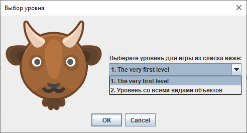
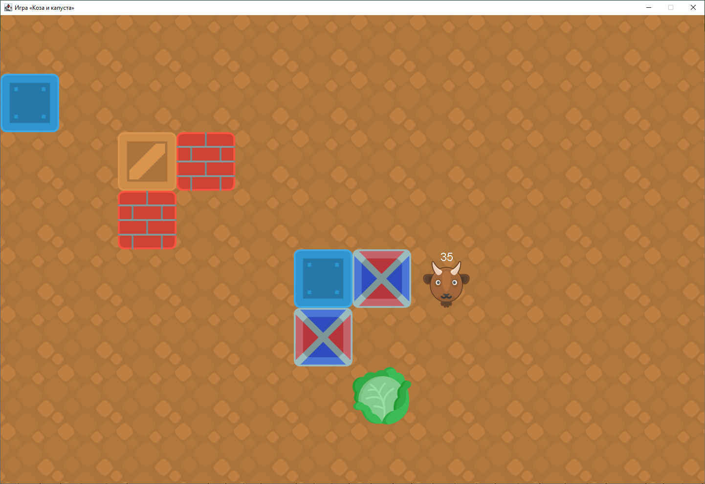

# Макеты экранных форм

### Начальный экран - Выбор уровня
При запуске игры можно выбрать уровень для игры.

### Начальное состояние игры
После выбора появляется начальное состояние уровня. Количество шагов козы указывается слева вверху.

### Состояние игры после хода
Движение козы осуществляется клавишами:
* W, ↑ - вверх;
* A, ← - влево;
* S, ↓ - вниз;
* D, → - вправо.

После движения козы её количество шагов уменьшается.

### Состояние игры после перемещения козы с ящиком
Коза может осуществлять захват ящиков. Для этого надо зажать клавишу Ctrl и использовать кнопки из предыдущего пункта для указания направления, в котором захватить ящик.

Чтобы отпустить ящик надо нажать клавишу "пробел".

Перемещение козы с одним ящиком:

Перемещение козы с несколькими ящиками:

### Игра завершена успешно - коза достигла капусты
При достижении козой капусты высвечивается MessageBox с сообщением об успешном завершении игры и окно игры закрывается.

### Игра завершена неуспешно - у козы кончились шаги
Когда у козы закончились шаги, и она не достигла капусты, высвечивается MessageBox с сообщением о неуспешном завершении игры и окно игры закрывается.
